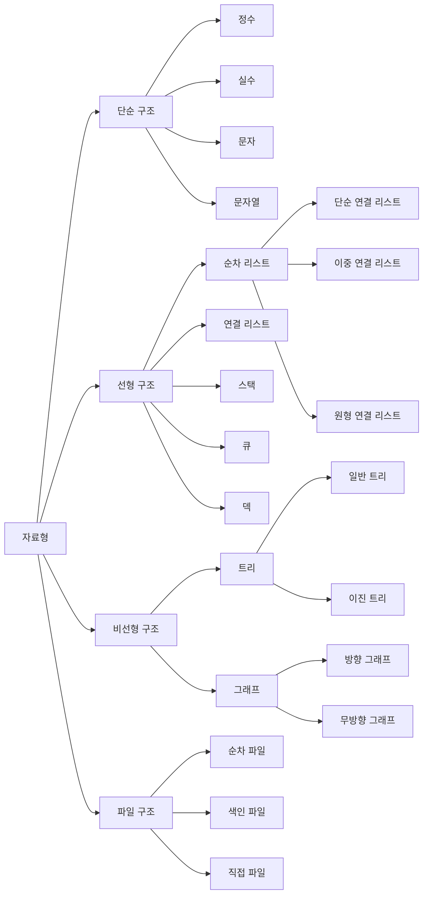

# 01. General

## 문 과 식 의 차이

* 문
  * 코드 엔진에서 해석하고 버리는 힌트 같은 것 (Java, Javascript, C, ... )
* 식
  * 변수에 할당되어 저장 된다 (Ruby, Kotlin, ... )

## Data Structure (자료구조)

자료를 효율적으로 이용할 수 있도록 컴퓨터에 저장하는 방법이다.

### 논리형

`true` `false` 중 하나를 값으로 갖으며, 조건식과 논리적 계산에 사용

* boolean : 1 Byte

### 문자형

문자를 저장하는데 사용되며 변수당 하나의 문자만 저장 가능

* char : 2 Byte

### 정수형

정수값을 저장하는데 사용되며 주로 `int` `long` 을 사용

* byte : 1 Byte
* short : 2 Byte
* int : 4 Byte
* long : 8 Byte

### 실수형

실수 값을 저장하는데 사용한다.

* float : 4 Byte
* double : 8 Byte

### Stack (스택)

* 마지막에 저장한 데이터를 가장 먼저 꺼내는 후입선출 (LIFO : Last In First Out) 구조로 되어 있다.
* 입력과 출력이 모두 한 방향에서 이루어지는 데이터 구조

#### 단점

* 바닥에 있는 데이터가 잔류하게 되는 경우가 생겨 우선순위에 관련된 문제가 생길 수 있다.

#### 용도

* 지역변수의 저장
* 임시데이터의 백업
* 함수 호출의 순서 제어
* 인터럽트의 제어
* 수식계산

### Queue

* 처음에 저장한 데이터를 가장 먼저 꺼내는 선입선출 (FIFO : First In First Out) 구조로 되어 있다.
* 입출력이 양방향에서 이루어지는 데이터 구조이다.
* 삽입 연산을 _**Enqueue**_ 삭제 연산을 _**Dequeue**_ 라고 한다.

#### 단점

* 데이터 삽입 후 계속 항목 삭제를 하면 REAR 와 FRONT 가 만나게 되어 공백 Queue 가 됨에도 불구하고 오버 플로우 현상이 생겨 메모리낭비 현상이 생기게 된다.

#### 용도

* OS 의 작업 스케쥴링
* 대기행렬 처리

> Queue 에서 데이터를 추출할 때는 첫번째 저장된 데이터를 삭제하므로 배열리스트와 같은 배열 기반 `Collection Class` 를 사용하면 데이터를 꺼낼때마다 빈공간을 채우기 위해 데이터의 복사가 발생한다.  
> 이는 성능저하를 야기 시키기 때문에 연결 리스트 (Linked List) 로 구현하는것이 적합하다.

### Deque (Double-End Queue : 데큐 / 덱)

* `Queue` 와 `Stack` 을 합쳐놓은 혼종이다.
* 양쪽 끝에서 삽입과 삭제가 모두 가능한 자료구조이다.
* 두개의 포인터를 사용하여 양쪽에서 삽입과 삭제를 방지시킬수 있다.

### Priority Queue (우선순위 큐)

우선순위가 높은 데이터가 먼저 작업 된다.

#### 구현 방법

* 배열을 기반으로 구현
* 연결리스트를 기반으로 구현
* 힙 (Heap) 이용하여 구현

> 데이터가 적을때는 문제가 없지만 _**데이터가 많을 경우에는 노드 수에 비례해서 비교를 하기 때문에 성능저하의 이슈**_가 있다.  
> 따라서 _**주로 힙 (Heap) 을 이용하여 구현**_ 하는 것이 일반적이다.

### Stack 과 Heap 의 비교

||Stack|Heap|
|--|--|--|
|접근 속도|빠른 접근|느린 접근|
|메모리 제한|제한적|제한 없음|
|Resize 가능|불가|가능 (파편화 가능성)|
|특징|지역변수에만 할당|전역적 접근|

### List 와 Map 의 비교

#### List

* 순차적으로 데이터를 저장한다.
* 값의 중복이 허용된다.
* 순차적인 접근이 필요할 경우 사용

#### Map

* 키를 중복으로 저장불가 하다. (값은 가능)
* 빈 공간을 찾아서 저장하기 때문에 List 보다는 데이터 저장속도가 느릴수 있다.
* 키값을 통해서 빠르게 데이터 검색 가능

## RBAC (Role Based Access Control : 역활기반 접근 통제)

접근하려는 사용자와 자원이 어떻게 상호작용하는지 결정하여 중앙에서 집중적으로 작용한다.

* 역할 할당 (Role Assignment)
* 역할 권한 부여 (Role Authorization)
* 권한 부여 (Permission Authorization)

## MAC (Mandatory Access Control : 강제적 접근 통제)

## DAC (Discretionary Access Control : 임의적 접근 통제)

## Separation Of Concern (관심의 분리)

SOA (Service-Oriented Architecture : 서비스 지향 아키텍처) 의 핵심 원칙중의 하나로 _**관심이 다른것은 가능한 분리하여 서로 영향을 주지 않도록 하며, 관심이 같은 것은 하나의 관련 객체로 모이도록 설계나 구현**_ 을 하는 것

## TDD / BDD / DDD

테스트 주도 개발 방법론들이다.

### TDD (Test Driven Development)

* 테스트 주도 개발 방법론
* 테스트 코드를 먼저 작성하고 해당 테스트 코드에 맞게 개발을 진행한다.

## BDD (Behavior Driven Development)

* 동작 지향 개발 방법론
* 소프트웨어의 품질을 향상 시키기 위해 개발자간의 협력 가능한 Agile Software Development 기법이다.
* BDD 의 목표는 TDD 를 수행하기 위한 것으로, TDD 를 수행하기 위해 BDD 를 통한 행위 자체를 변경 가능하다.