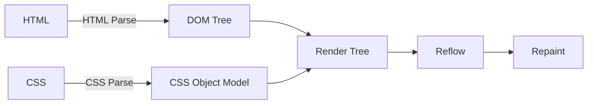

# 01. HTML

## DTD \(Document Type Definition\)

_**HTML**_ 에서 문서 형식을 지정하는 것을 _**DTD**_ 라고 하며 _**DTD**_ 는 _**HTML**_ 문서에 첫번째 줄에 위치해야 한다.

문서형식은 HTML 버전과 종류를 명시함으로써, _**브라우저가 문서를 해석하고 출력하는데 직접적으로 영향**_ 을 준다. 

올바르게 문서형식이 지정된 경우에는 표준 \(Strict\) 방식, 그렇지 않는 경우에는 호환 \(Quirks\) 방식으로 출력한다.

#### 호환 출력 방식 \(Quirks Rendering Mode\) 특징 

* 브라우저가 HTML 을 랜더링 \(읽기, 해석, 출력\) 하는 시간이 더 걸린다.
* 브라우저마다 HTML 출력을 각각 다르게 출력한다.

#### Example #1 : HTML

```markup
<!DOCTYPE html>
<html>
    <head></head>
    <body></body>
</html>
```

## onload

object 가 로드 되었을 때 발생 합니다.  
웹 페이지가 모든 컨텐츠 \(이미지, 스크립트 파일, 스타일시트\) 등을 완전히 로드한 후 실행 합니다.

### Syntax

```markup
<tag onload="myScript"></tag>
```

```markup
<tag onload="script"></tag>
```

```javascript
object.onload = function () {/* script */};
```

```javascript
object.addEventListener('load', script);
```

### Detail

| Feature | Description |
| :--- | :--- |
| 이벤트 버블링 | NO |
| 중단 가능 여부 | NO |
| 이벤트 유형 | UI 생성시 |
| 지원 태그 | `<body>`, `<frame>`, `<iframe>`, ``, `<input type="image">`, `<link>`, `<script>`, `<style>`  |
| DOM 버전 | Level 2 이벤트 |

## 시맨틱 \(Semantic\) 마크업

브라우저가 웹 문서 \(HTML\) 를 정확히 읽어내기 위하여 _**정보의 의미에 맞는 HTML Tag**_ 를 이용하여 작성하는 것  
출력 형태는 `<div>` 와 별 차이는 없다.

### 장점

* 웹 접근성이 좋아짐
* SEO \(Search Engine Optimization\) 개선 효과
* 코드 가독성, 재사용성이 높아짐

대표적으로 `<header>` `<nav>` `<section>` `<article>` `<footer>` 가 있다.

| 태그 | 설명 |
| :--- | :--- |
| section | 문서의 구획 \(예: 장, 절\) |
| article | 독립된 콘텐츠 영역 \(예: 개별 신문기사\) |
| nav | 네비게이션 메뉴 영역 |
| aside | 부가 콘텐츠\(예: 사이드바, 광고 등\) 본문 내용과 비교적 관련성이 적은 것 |
| header | 헤더글. 본문 위에 첨가하는 짧은 글 영역 |
| footer | 바닥글. 본문 아래에 첨가하는 짧은 글 영역 |
| hgroup | 제목\(h1 ~ h6\) 을 그룹화하는 요소 |

## HTML 랜더링 순서



1. 사용자가 브라우저에 URL을 입력하거나 이동을 한다.
2. 브라우저 인터페이스 엔진에서 해당 작업을 분석 한다.
3. 페이지 이동이 확인되면 해당 서버에 정보를 요청 한다.
    1. 도메인의 경우 `DNS Lookup` 을 통하여 서버 IP 경로를 얻어온다.
    2. 얻어온 서버 경로로 필요한 경로 정보를 요청 한다. (3 Way Handshake)
    3. HTTP 요청 응답이 MIME 타입을 확인하여 해당 자원을 다운로드 한다.
4. 다운로드 된 HTML 및 CSS 문서를 해석하는 과정을 거친다
    1. HTML 을 해석하여 DOM Tree 구성을 한다.
    2. CSS 를 해석하여 `CSSOM` (Cascading Style Sheets Object Model) 을 구성한다.
    3. 위 두 구성이 모두 완료 하여야만 다음 진행이 가능하다. (CSS : 랜더링 블라킹 요소)
    4. 이후 자바스크립트 태그 혹은 구문을 만나면 약속된 프로세스 (비차단 스크립트) 대로 진행 한다.
5. `DOM Tree` & `CSSOM` 이 완료 되면 `Render Tree` 구성을 진행한다.
    1. CSS 규칙중 `{display:none}` 을 만나면 `Render Tree` 구성에서는 빠진다. (`DOM Tree` 에는 존재)
6. `Render Tree` 구성이 완료되면 `Reflow` 작업을 통하여 필요한 레이아웃을 화면에 배치한다.
7. `Reflow` 작업이 완료 되면 `Repaint` 과정을 통하여 화면에 배치한 레이아웃을 그린다.

## 웹 사이트의 속도 개선

일반적으로 웹 사이트의 최적화 방법으로는 아래와 같은 방법들이 있다.

* 이미지 최적화
* 브라우저 캐싱 사용
* HTML / CSS / JS 축소 및 압축전송 사용 (gzip)
* 방문 리다이렉션 사용 안함
* HTTP Request 최소화
* Reflow, Repaint 최소화

추가적으로 브라우저에서 Reflow 를 일으킬만한 요소들을 최소화 하기 위하여 다음 가이드라인을 참고한다.

### 브라우저 리플로우 (Reflow) 최소화를 위한 가이드 라인

사용자의 브라우저 별로 리플루우 (Reflow) 가 걸리는 시간도 상이 하지만 대부분의 리플로우를 일으키는 조건은 동일하여 아래의 가이드라인을 통하여 충분히 개선이 가능하다.

* 불필요한 DOM Depth를 줄인다.
  * DOM Tree 의 Depth 하나를 변경하면 트리의 모든 Depth 에 따라 더 많은 시간이 소요된다.
  * 부모로는 Root, 자식은 Update 된 Node 까지 변경 될 가능성이 있음
* CSS 규칙을 최소화 하고 사용하지 않는 CSS 규칙을 삭제한다.
* 애니메이션과 같이 복잡한 랜더링 요소는 흐름의 밖에서 변경한다.
  * 변경시에는 절대 위치 혹은 고정 위치를 사용한다.
* 불필요하거나 복잡한 CSS 선택기 하위요소 선택기를 사용하지 않는다.
  * 선택기와 일치시키기 위해서 더 높은 GPU 처리량의 필요가 요구된다.

> Reference  
> 
> https://developers.google.com/speed/docs/insights/browser-reflow?hl=ko  
> http://lists.w3.org/Archives/Public/public-html-ig-ko/2011Sep/att-0030/Reflow_____________________________Tip.pdf  
> http://www.stubbornella.org/content/2009/03/27/reflows-repaints-css-performance-making-your-javascript-slow/