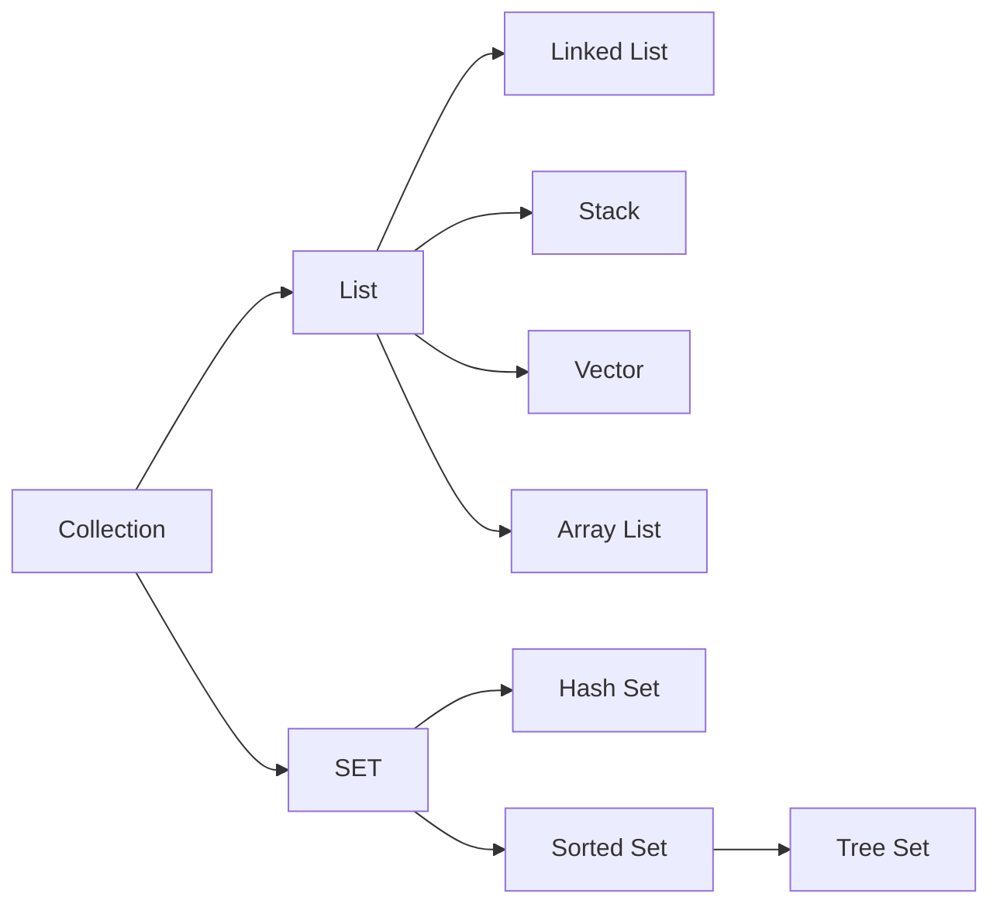
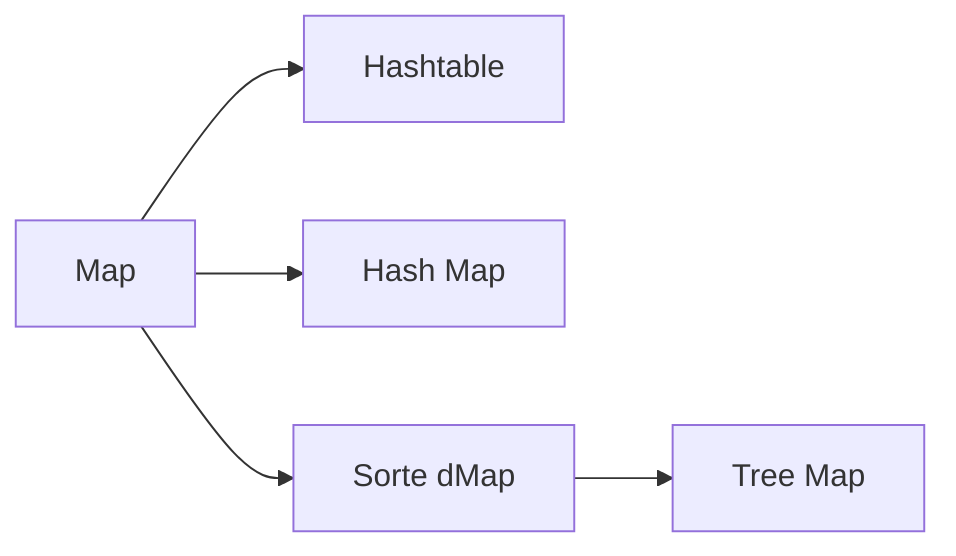

# 01. Java

## String / StringBuffer / StringBuilder 의 사용

문자열을 더하는 식에는 `string` 보다는 `stringBuffer` 나 `stringBuilder` 을 사용해야 한다.

`string` 은 새로운 값을 할당할 때마다 새로 생성되기 때문 \(클래스의 메모리 참조 주소가 바뀜\)

`stringBuffer` 나 `stringBuilder` 는 값을 메모리에 append 하는 방식으로 클래스를 별도로 생성하지 않는다.

`stringBuilder` 는 변경 가능한 문자열로 synchronization 이 적용되지 않는다.

`stringBuffer` 는 _**멀티쓰레드 환경에서 안정적**_ 이다.

## Log4j

### Log Level

1. TRACE
   * 해당되는 내용에 대한 경로추적을 위해 사용
2. DEBUG
   * 디버깅을 위한 목적
3. INFO
   * 시스템 동작에 대한 정보를 제공
   * 버그나 시스템 문제는 아니고, 단지 운영자에게 정보를 제공
4. WARN
   * 현재 운영에는 문제가 없지만, 문제가 될 수 있는 사항
   * 예외가 발생하지는 않았지만 해당 정보에 대해서 알려주어야 할 경우
5. ERROR
   * 시스템 운영에 문제가 있을 만한 사항
   * 보통 예외를 잡아서 정상처리한 경우 기록
6. FATAL
   * 시스템 운여이 불가능한 경우
   * 보통 예외가 발생하고 정상 처리 못한 경우

### Layout

* %d : 로그의 기록시간을 출력
* %p : 로깅의 레벨을 출력
* %F : 로깅이 발생한 프로그램의 파일명을 출력
* %M : 로깅이 발생한 메소드의 이름을 출력
* %I : 로깅이 발생한 호출지의 정보를 출력
* %L : 로깅이 발생한 호출지의 라인수를 출력
* %t : 로깅이 발생한 Thread명을 출력
* %c : 로깅이 발생한 카테고리를 출력
* %C : 로깅이 발생한 클래스명을 출력
* %m : 로그 메시지를 출력
* %n : 개행 문자를 출력
* %% : %를 출력
* %r : 어플리케이션이 시작 이후부터 로깅이 발생한 시점까지의 시간\(ms\)을 출력
* %x : 로깅이 발생한 Thread와 관련된 NDC\(Nested diagnostic context\)를 출력
* %X : 로깅이 발생한 Thread와 관련된 MDC\(Mapped diagnostic context\)를 출력

### Sample

```java
[%d{yyyy-MM-dd HH:mm}] %5p (%F:%L) %M: %m%n
```

```java
[%d{HH:mm:ss}] %-5p %C{1}.%M(%F:%L) - %m%n
```

## Collection



## Map



> Reference  
> http://withwani.tistory.com/150