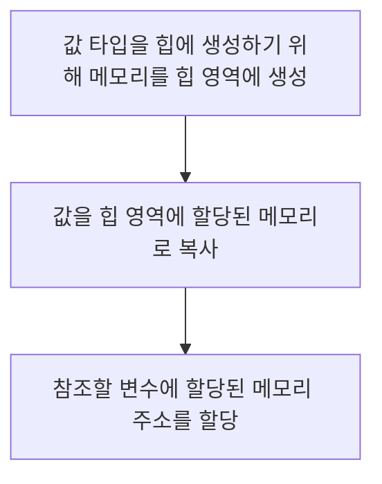
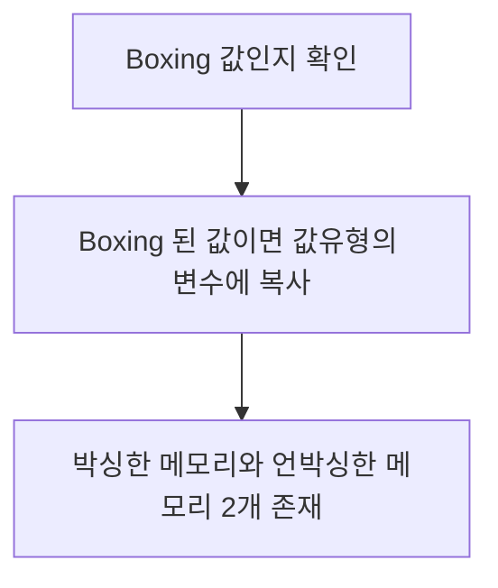

# General

## Thread & Process

### Thread

* 프로세스가 할당받은 자원을 이용하는 실행의 단위
* 프로세스와 같은 공간의 Stack 공간을 사용하며 여러 Thread 는 그 상태의 일부를 공유한다.

### Process

* 실행중인 프로세스 객체
* CPU 시간이나 메모리 등의 시스템 자원이 할당되는 독립적인 개체
* 프로세스간의 통신은 Pipe, Socket, File 등으로 통신한다.

> _**Multi Thread**_ 환경의 작업시에는 Therad 간의 자원 공유의 _**동기화 문제**_ 에 신경을 써야 한다.

## Overloading & Overriding

### Overloading (오버로딩)

같은 이름의 함수를 여러개 정의하고 매개변수의 유형과 개수를 다르게 하여 다양한 유형의 호출에 응답

### Overriding (오버라이딩)

상의 클래스가 가지고 있는 메소드를 하위 클래스가 재 정의 하여 사용하는 것  
어떤 메소드가 실행될지는 _**Dynamic Dispatch (동적 디스패치)**_ 가 일어나며 확인 가능하다.

> Dispatch ?
> * Static Dispatch : 컴파일 시점에서는 알 수 있다.
> * Dynamic Dispatch : 런타임 순간에 알 수 있다.

## Boxing & Unboxing (박싱 & 언방식)

* Boxing : 값 (원시타입) 을 참조 형식으로 변환
* UnBoxing : 참조 형식을 값 형식으로 변환

```java
// Boxing
Object a = 20;

// UnBoxing
int b = (int) a;
```

### Boxing 과정



### Unboxing 과정



### 문제점

* 모든 객체가 값 형식으로 언박싱 될 수 없고, 이전에 박싱된 데이터에 한하여 언박싱이 가능하다.  
* 또한 박싱된 데이터의 타입을 따라야 한다.  
* 박싱 작업은 완전히 새로운 객체가 만들어져야 하며 이러한 작업은 할당 작업보다 _**최대 20배의 시간**_ 이 걸린다고 한다  
* 언박싱의 캐스팅 시간은 할당작업보다 _**4배이상**_ 의 시간이 걸린다고 한다.

### Example - JAVA

```java
public class Sum {

    // 캐스팅 시간 4배, 박싱 작업 20배 느려짐 예제
    public static void main (String[] args) {
      // long sum = 0L;
      Long sum = 0L;

      for (long i = 0; i < Integer.MAX_VALUE; i++) {
        sum += i;
      }

      System.out.println(sum);
    }
}
```

> Reference
>
> http://grayt.tistory.com/87

## Compile Running

1. 소스코드를 작성
2. Compiler 는 JAVA 소스코드를 이용하여 클래스 파일을 생성
3. 컴파일된 파일은 JVM (Java Virtual Machine) 이 인식 가능한 바이너리 파일로 변환
4. JVM 은 클래스 파일의 바이너리 코드를 해석하여 프로그램을 실행
5. 수행 결과가 컴퓨터에 반영

## Access Modifier (접근 제어자)

Java 에는 다음과 같은 접근 제어자가 있다.  
다음 순으로 접근을 허용한다.


### Private

해당 클래스 내에서만 접근 가능하다.

### Default

접근 제어자를 따로 설정하지 않은 변수 혹은 메소드는 `default` 접근 제어자가 되어 해당 패키지 내에서만 접근 가능하다.  
해당 패키지 내에서만 접근 가능하다.

### Protected

동일패키지 내의 클래스에서 접근 가능하다.
해당 클래스를 상속 받은 외부 패키지의 클래스에서 접근 가능하다.

### Public

어떤 클래스에서라도 접근 가능하다.

> https://wikidocs.net/232