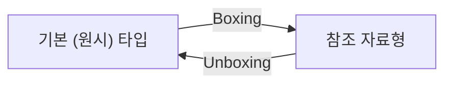
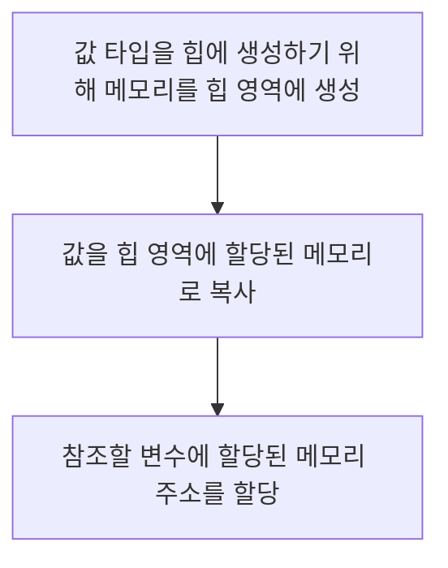
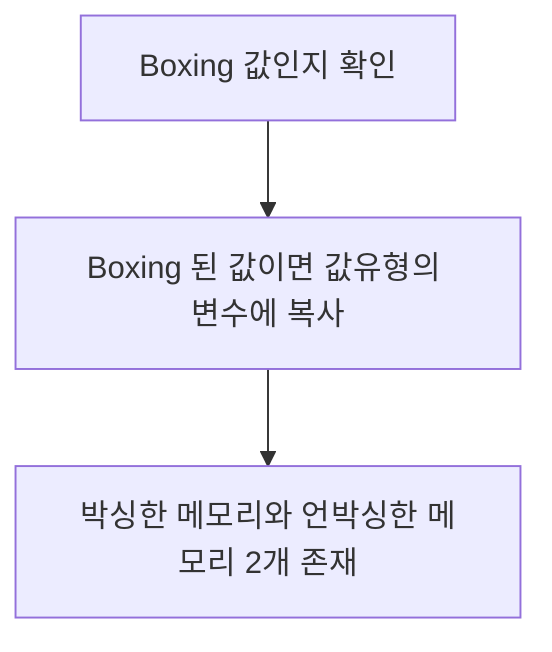
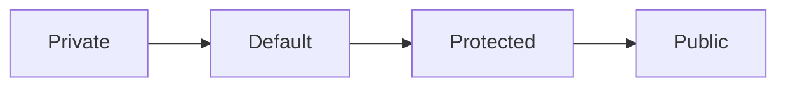

# General

## JDK & JRE 차이점

### JDK (Java Development Kit)

Java 의 응용프로그램을 개발할 수 있는 소프트웨어 개발 키트이다.

### JRE (Java Runtime Environment)

Java 프로그램 코드가 실행되는 JVM 을 지칭함

## `static` 키워드의 의미

Java Class 의 멤버 변수 또는 메소드가 속한 클래스의 인스턴스화를 요구하지 않고 액세스 할 수 있는 _**접근제어자**_ 입니다.  
`static` 접근 제어자로 지정된 변수 혹은 메서드는 Java Runtime 시에 Compile 시에 정적으로 바인딩 되기 때문에 재정의 (수정) 이 불가 합니다.

## interface 와 abstract 의 공통점 & 차이점

인터페이스 (interface) 와 추상 클래스 (abstract) 는 근본적으로 다른 목적에 의해 구현된다.

||interface|abstract|
|--|--|--|
|목적|함수의 구현을 강제화|상속을 통하여 기능을 이용하고 확장함|
|구현 방식|반드시 모든 메소드를 구현|모든 메소드를 구현하지 않아도 됨|
|다중 상속|가능|불가|
|접근 제어자|`public`|`private`, `protected`, `public`|
|변수|기본적으로 `final` 로써 최종 변수임|비 최종 변수를 포함할 수 있음|

## Boxing & Unboxing (박싱 & 언방식)

Java 의 데이터는 클래스나 객체와 같은 _**참조자료형**_ 과 기본적인 _**원시타입**_ 을 가질 수 있다.  
이는 다시 말해 각각의 기초 자료형을 포장되어 있는 `Wrapper Class` 로 변환이 가능하다.



* Boxing : 값 (기초 타입) 을 참조 형식으로 변환
* Unboxing : 참조 형식을 값 형식으로 변환

|기본형 타입|참조 자료형 (Wrapper Class)|
|--|--|
|byte|Byte|
|short|Short|
|int|Integer|
|long|Long|
|float|Float|
|double|Double|
|char|Character|
|boolean|Boolean|
|void|Void|

```java
// Boxing
Object a = 20;

// UnBoxing
int b = (int) a;
```

### Boxing 과정



### Unboxing 과정



### 문제점

* 모든 객체가 값 형식으로 언박싱 될 수 없고, 이전에 박싱된 데이터에 한하여 언박싱이 가능하다.  
* 또한 박싱된 데이터의 타입을 따라야 한다.  
* 박싱 작업은 완전히 새로운 객체가 만들어져야 하며 이러한 작업은 할당 작업보다 _**최대 20배의 시간**_ 이 걸린다고 한다  
* 언박싱의 캐스팅 시간은 할당작업보다 _**4배이상**_ 의 시간이 걸린다고 한다.

### Example - JAVA

```java
public class Sum {

    // 캐스팅 시간 4배, 박싱 작업 20배 느려짐 예제
    public static void main (String[] args) {
      // long sum = 0L;
      Long sum = 0L;

      for (long i = 0; i < Integer.MAX_VALUE; i++) {
        sum += i;
      }

      System.out.println(sum);
    }
}
```

> Reference
>
> http://grayt.tistory.com/87

## Compile Running

1. 소스코드를 작성
2. Compiler 는 JAVA 소스코드를 이용하여 클래스 파일을 생성
3. 컴파일된 파일은 JVM (Java Virtual Machine) 이 인식 가능한 바이너리 파일로 변환
4. JVM 은 클래스 파일의 바이너리 코드를 해석하여 프로그램을 실행
5. 수행 결과가 컴퓨터에 반영

## Access Modifier (접근 제어자)

Java 에는 다음과 같은 접근 제어자가 있다.  
다음 순으로 접근을 허용한다.



### Private

해당 클래스 내에서만 접근 가능하다.

### Default

접근 제어자를 따로 설정하지 않은 변수 혹은 메소드는 `default` 접근 제어자가 되어 해당 패키지 내에서만 접근 가능하다.  
해당 패키지 내에서만 접근 가능하다.

### Protected

동일패키지 내의 클래스에서 접근 가능하다.
해당 클래스를 상속 받은 외부 패키지의 클래스에서 접근 가능하다.

### Public

어떤 클래스에서라도 접근 가능하다.

> https://wikidocs.net/232

## Finalize

객체가 소멸될때 호출되는 메소드  
사용이 권장 되지 않는다.

## Checked & Unchecked Exception

`Checked Exception` 는 외부 환경에 의해 미리 예상 되는 오류이다.

예를 들면 `IOException` `ClassNotFoundException` 등과 같이 _**반드시 예외처리가 필요하다.**_

`Unchecked Exception` 는 프로그램 로직상의 문제로 일어나는 로직상의 오류로써 미리 예상할 수 없다.

대표적으로 `RuntimeException` 과 같이 프로그램 실행중에 일어나며 _**반드시 예외처리를 필요로 하지 않는다.**_

## 객체 재사용

대표적으로 `Singleton` 디자인 패턴과 같이 미리 사전에 생성된 `Instance` 를 재사용하는 방식으로 일반적으로 `ThreadPool` 이나 `Connection Pool` 등의 방식으로 주로 사용한다.