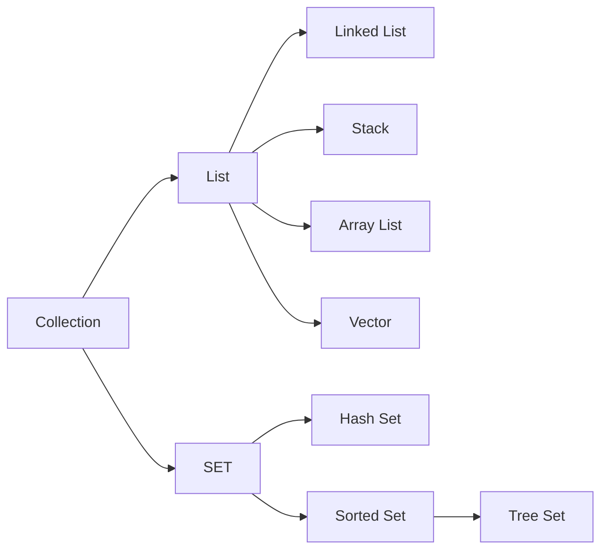
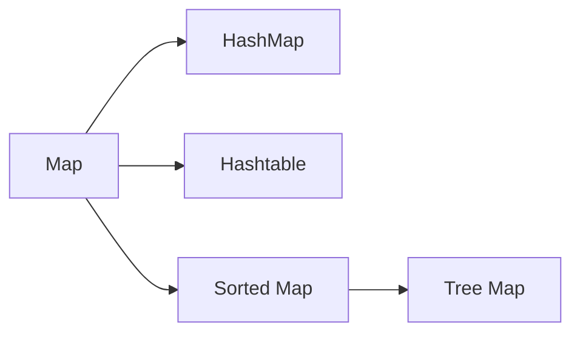

# Collection

`Collection` 인터페이스를 상속 받은 구현체 `List` 와 `Set` 을 기준으로 나뉜다.

## List

순서가 있는 `Collectaion` (삽입된 순서)  
Data 를 중복해서 포함할 수 있다.

* Linked List
* Stack
  * 후입선출 (LIFO : Last-In First-Out) 구조로 되어 있다.
* ArrayList
  * 동기화를 보장하지 않는다.
  * 배열의 동적 메모리 증가 기능을 구현한 클래스
* Vector  
  * 자동으로 동기화를 보장해 준다.
  * ArrayList 의 동기화가 보장되도록 최적화한 클래스
  * JDK 5.0 이후부터 Auto Boxing / UnBoxing 기능을 지원
* Tree Set
  * 정렬 기능을 지원 (데이터들이 자동으로 오름차순으로 정렬)

> AutoBoxing
> 기본 데이터 타입을 Wrapper 클래스형의 객체로 자동 변환해주는 기능

## Set

집합적인 개념의 Collection  
순서의 의미가 없다.  
Data 를 중복해서 포함할 수 없다.

* Hash Set
  * Hash 기법을 사용하지만 Set 인터페이스를 구현하고 있다.
* Sorted Set
  * 정렬 기능을 지원함

## Map

`Key` 와 `Value` 의 형태로 데이터를 관리한다.

* HashMap
  * 동기화 보장이 안된다.
* Hashtable
  * 동기화 보장이 된다. (멀티스레드 환경에서 안정적)
* TreeMap
  * 정렬 기능을 지원함

> Reference  
> 
> http://withwani.tistory.com/150

### Hashtable & ConcurrentHashMap

`HashMap` 을 thread-safe 하도록 만든 클래스가 ConcurrentHashMap 이며, key & value 에 null 을 허용하지 않는다.  
둘 다 동기화 보장을 하는 특징이 있지만 구조적으로 작은 차이가 있다.

* Hashtable
  * `synchronized` 키워드를 Method 전체에 Lock 을 적용한다.  
  * 상대적으로 안정하지만 확장성이 떨어진다.
  * Hashtable 을 참조하는 Thread 의 갯수가 많아질수록 Lock 을 획득하기 위한 시간비용이 많이 들어 성능이 급격히 낮아진다.
* ConcurrentHashMap
  * 내부적으로 여러개의 세그먼트를 두고 각 세그먼트마다 별도의 락을 가지고 있다.
  * 동시에 데이터를 삽입, 참조 하더라도 그 데이터가 다른 세그먼트에 위치하면 서로 Lock 을 얻기 위해 경쟁하지 않는다.
  * 이러한 방식을 _**Lock Striping**_ 이라고 한다.

> Reference  
> 
> http://egloos.zum.com/Agbird/v/4849046