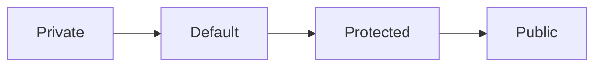

# Access Modifier

Java 에는 다음과 같은 접근 제어자가 있다.  
다음 순으로 접근을 허용한다.

## Private

해당 클래스 내에서만 접근 가능하다.

## Default

접근 제어자를 따로 설정하지 않은 변수 혹은 메소드는 `default` 접근 제어자가 되어 해당 패키지 내에서만 접근 가능하다.  
해당 패키지 내에서만 접근 가능하다.

## Protected

동일패키지 내의 클래스에서 접근 가능하다.
해당 클래스를 상속 받은 외부 패키지의 클래스에서 접근 가능하다.

## Public

어떤 클래스에서라도 접근 가능하다.

> https://wikidocs.net/232