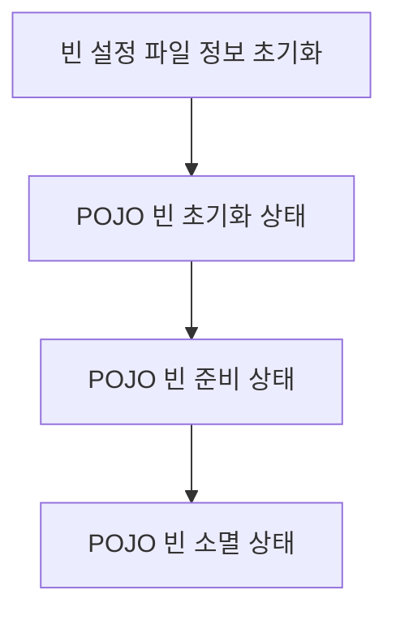

# Spring

## Framework vs Library

가장 크게는 제어의 흐름이 다르며  
`Framework` 는 사용자의 코드가 프레임워크에 사용되는 것이고  
`Library` 는 사용자에 코드에 의해 소비되는 것이다.

Framework 는 `IoC` 개념이 적용되어야 하며 이는 특정의 프로세스를 프레임워크가 처리 가능하도록 제어를 넘김으로써 _**클라이언트 코드가 라이브러리의 메소드를 호출해서 사용하는 것**_ 을 의미합니다.

## AOP \(Aspect Oriented Programming : 관점 지향 프로그래밍\)

_**어플리케이션 전체에 사용되는 기능을 재사용 하도록 지원**_ 하도록 도와주는 것

_**관심의 분리 \(Seperation of Concerns\) 를 통하여 핵심 관심 사항 \(입금, 출금, 이체\) 에 집중**_ 하는것이다.


### 장점

* 중복되는 코드 제거
* 효율적인 유지보수
* 높은 생산성
* 재활용성 극대화
* 유연한 변화 수용

## IoC \(Inversion of Control : 제어의 역전\)

_**프로그램의 제어의 흐름 구조가 바뀌는 것이다.**_

일반적인 객체의 흐름은 다음과 같다.

1. 객체 생성
2. 의존성 객체 생성 \(클래스 내부\)
3. 의존성 객체 메소드 호출

하지만 스프링 내부에서는 다음과 같은 순서로 생성 및 실행된다.

1. 객체 생성
2. 의존성 객체 주입 \(스프링에게 위임하여 만들어놓은 객체\)
3. 의존성 객체 메소드 호출

스프링이 모든 의존성 객체를 스프링이 실행될때 다 만들어 주고 필요한 곳에 주입시켜줌으로써  
_**Bean**_ 들은 _**싱글턴 패턴의 특징**_ 을 가진다.

제어의 흐름을 사용자가 컨트롤 하는것이 아닌 _**스프링에게 맏겨 작업을 처리(스프링이 처리)**_ 하게 된다.

사용자는 자신이 만든 객체가 어디에 사용되는지 알 수 없고 제어 권한을 위임받는 특별한 객체에 의해서 만들어지고 사용된다.

이는 다음 두가지의 구현 방법 으로 설명 된다.

### DL (Dependency Lookup : 의존성 검색)

저장소에 저장되어 있는 _**빈 (Bean)**_ 에 접근하기 위해 개발자들이 컨테이너에서 제공하는 API 를 이용하여 사용하고자 빈을 Lookup 하는 것

### DI (Dependency Injection : 의존성 주입)

각 계층 사이와 각 클래스 사이의 필요로 하는 의존 관계를 컨테이너가 자동으로 연결해 주는것

_**DL**_ 을 사용시 컨테이너의 종속성이 증가하여, 이를 줄이기 위해서 _**DI**_ 를 사용

```java
public class Parent {
    private Child child;

    public void setChild(Child child) {
        this.child = child;
    }
}
```

스프링에서는 객체의 생성과 소멸에 관련된 작업을 자동으로 수행해 주는데 객체가 생성되는곳을 _**Bean Container**_ 라고 한다.

스프링에서는 객체를 _**Bean**_ 이라고 부르며, 프로젝트가 실행될 때 사용자가 _**Bean**_ 으로 관리하는 객체들을 자동으로 생성해 준다.

스프링에서 실행할 때 생성했던 _**Bean**_ 을 주입시켜주는 과정을 _**DI**_ 라고 한다.

### 용어 정리

#### Bean

* 스프링 (정확히는 스프링 컨테이너) 에서 생성 및 및 관계 설정, 사용등을 제어해주는 객체

#### Bean Factory

* 스프링이 IoC 를 담당하는 핵심 컨테이너
* 빈을 등록/생성/조회/반환/관리 하는 기능으로 bean factory 와 같지만 여기에 spring 의 각종 부가서비스를 추가로 제공해야 한다.

#### Application Context

* bean factory 를 확장한 IoC 컨테이너

#### Container (IoC Container)

* 객체를 관리하는 컨테이너로써 컨테이너에 객체를 담아두고 필요할 때에 컨테이너에서 객체를 가져와 사용할 수 있도록 한다.
* IoC 방식으로 Bean 을 관리한다는 의미에서 Bean Factory 나 Application Context 를 가르킨다.

#### POJO (Plain Old Java Object)

* ??????????

> Reference  
> http://javaslave.tistory.com/48

## Spring Bean Life Cycle



### POJO (Plain Old Java Object) 초기화 과정

1. Spring Framework 는 먼저 `Bean` 설정파일의 POJO 빈을 Instance 화 하지 않은 상태로 `Bean` 설정 파일의 정보를 초기화 한다.
    1. 빈 설정 파일의 정보를 초기화 하면서 XML DTD 에 대하여 유효한지 체크한다.
2. Bean Instance 를 생성하면서 의존 관계에 있는 Bean 이 존재하는지 여부를 체크한다.
    1. 의존 관계가 없는 Bean 인 경우 초기화가 실패 한다.
3. 의존 관계가 있는 빈의 체크가 완료되면 `setter Method` 를 호출하거나 생성자의 인자로 실질적인 값을 추가하거나 다른 Bean 에 대한 Reference 로 전달한다.
4. Application Context 를 이용하여 초기화를 실행한다.
    1. 생성한 Bean 이 BeanNameAware Instance 이면 setBeanName() Method 를 호출한다.
    2. 생성한 Bean 이 BeanFactoryAware Instance 이면 setBeanFactory() Method 를 호출한다.
    3. 생성한 Bean 이 ApplicationContextAware Instance 이면 setApplicationContext() Method 를 호출한다.
    4. 생성한 Bean 이 InitalizingBean 인스턴스이면 afterProperties() Method 를 호출한다.
5. 생성한 Bean 의 설정파일에 init-method 가 설정되어 있다면 init-method 에 해당하는 Method 를 호출한다.

### 종료 Method 를 호출하는 과정

1. 생성한 Bean 이 DisposableBean Instance 이면 distory() Method 를 호출한다.
2. 생성한 Bean 설정파일에 distory-method 가 설정되어 있으면 destory-method 에 해당하는 메소드를 호출한다.

> Bean Life Cycle 을 커스터마이징 하여 제어 할 수 있다.

## Spring Boot 기동

### Linux Deploy Shell Script

리눅스 환경에서 쉽게 관리를 위해 _**Shell Script**_ 형태로 만들어 두어 관리한다.

#### start.sh

앱을 시작하고 해당 _**PID**_ 를 파일에 저장한다.

```bash
#!/bin/bash
java -jar myapp.jar & echo $! > ./pid.file &
```

#### stop.sh

저장된 _**PID**_ 를 사용하여 앱을 중지 한다.

```bash
#!/bin/bash
kill $(cat ./pid.file)
```

> 참고 경로   
> [https://code.i-harness.com/ko/q/195154c](https://code.i-harness.com/ko/q/195154c)

#### Gradle 로 Spring Boot 기동 

```bash
# gradle bootRun
```

> Reference
> http://isstory83.tistory.com/m/91