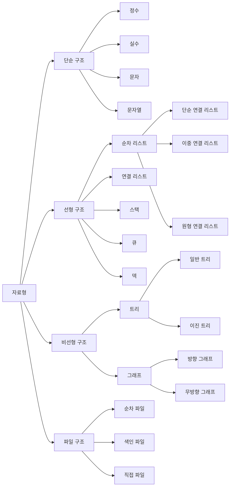

# Data Structure

자료를 효율적으로 이용할 수 있도록 컴퓨터에 저장하는 방법이다.

```mermaid
  graph LR
    A["자료형"] --> B["단순 구조"]
    B --> F["정수"]
    B --> G["실수"]
    B --> H["문자"]
    B --> I["문자열"]
    A["자료형"] --> C["선형 구조"]
    C --> J["순차 리스트"]
    C --> K["연결 리스트"]
    J --> O["단순 연결 리스트"]
    J --> P["이중 연결 리스트"]
    J --> Q["원형 연결 리스트"]
    C --> L["스택"]
    C --> M["큐"]
    C --> N["덱"]
    A["자료형"] --> D["비선형 구조"]
    D --> R["트리"]
    R --> T["일반 트리"]
    R --> U["이진 트리"]
    D --> S["그래프"]
    S --> V["방향 그래프"]
    S --> W["무방향 그래프"]
    A["자료형"] --> E["파일 구조"]
    E --> X["순차 파일"]
    E --> Y["색인 파일"]
    E --> Z["직접 파일"]
```
