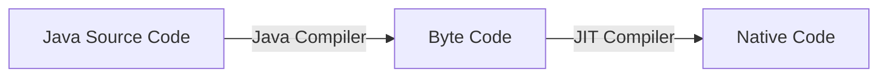

# JVM (Java Vertual Machine)

프로그램을 실행하기 위해 물리적 머신 (컴퓨터) 과 유사하게 만든 머신을 소프트웨어로 구현한 것으로  
실제로 _**Java Byte Code 를 실행할 수 있는 프로세스 가상 머신**_ 이다.

OS 별로 종류가 다른데 MS Window & Linux 등의 환경에서는 `HotSpot VM`, IBM AIX 의 경우에는 `IBM J9` 이 사용된다.

## 특징

* 자바의 가상머신으로 OS 에 종속적이지 않아 독립적으로 운영된다.
* GC (Garbage Collection) 은 사용자에 의해 명시되지 않으며 자동으로 메모리 관리가 된다.

프로그램이 실행되면 JVM 은 _**OS 로부터 프로그램이 필요로하는 메모리를 할당**_ 받고, JVM 은 이 메모리를 _**용도에 따라 여러 영역으로 나누어 관리**_ 한다.

## JVM 외부

Java 로 작성한 코드는 _**Class Loader 가 컴파일된 Java Byte Code 를 Runtime Data Areas 에 로드하고 Excution Engine 이 Java Byte Code 를 실행**_

## Compile Running

1. 소스코드를 작성
2. Compiler 는 JAVA 소스코드를 이용하여 클래스 파일을 생성
3. 컴파일된 파일은 JVM (Java Virtual Machine) 이 인식 가능한 바이너리 파일로 변환
4. JVM 은 클래스 파일의 바이너리 코드를 해석하여 프로그램을 실행
5. 수행 결과가 컴퓨터에 반영

## Class Loader (클래스 로더)

자바는 Runtime 시에 Class 를 로드하고 링크하는 Dynamic Loading 특징이 있다.

이 Dynamic Loading 특징을 담당하는 부분이 _**Class Loader**_ 이다.  

_**Class Loader**_ 는 로드된 클래스를 보관하는 Namespace 를 갖는데,  
이미 로드된 클래스 인지 확인하기 위하여 Namespace 에 보관된 `FQCN` 을 기준으로 클래스를 찾는다.

> FQCN (Fully Qualified Class Name) ?
>  
> 클래스가 속한 패키지명을 모두 포함한 이름을 말한다.  
> 보통 `java.lang.String s = new java.lang.String();` 과 같이 Alias Name (축약) 형이 아닌 패키지를 모두 포함한 경로  
> Class Loader 에서는 비록 FQCN 이 같더라도 Namespace 가 다르면 다른 클래스로 간주

_**Class Loader**_ 의 대표적인 역활은 사용자가 작성한 Java Byte Code 를 JVM 메모리상에 올려주는 역활을 한다.

### 클래스 로더 특징

클래스 로더는 다음과 같은 특징이 있다.

* Hierarchical (계층 구조)
  * 클래스 로더끼리 부모 <-> 자식 관계를 이루어 계층 구조로 구성된다.
  * 최 상의 클래스 로더는 부트스트랩 (Bootstrap Class Loader) 클래스 로더이다.
* Delegate Load Request (위임 모델)
  * 계층 구조를 기반으로 클래스 로더끼리 로드를 위임하는 구조로 동작 한다.
  * 클래스를 로드할 때 먼저 상위 클래스로더를 확인하여 존재하면 해당 클래스를 사용하고 없으면 요청 받은 클래스 로더가 클래스를 로드한다.
* Have Visibility Constraint (가시성)
  * 하위 (자식) 클래스 로더는 상위 (부모) 클래스 로더를 찾을수 있지만 그 반대의 경우 (부모 -> 자식) 은 있을 수 없다.
* Cannot unload Classes (언로드 불가)
  * 클래스 로더는 Unload 기능을 하지 않는다. (Unload 는 GC 자동으로 함)

### 클래스 로더 요청 처리

Class Loader 가 Class Load 를 요청 받으면, 아래 순서대로 검색을 한다.

Bootstrap Class Loader 까지 확인해도 없으면 요청 받은 클래스 로더가 _**파일 시스템에서 해당 클래스를 찾음**_

> ### 참고자료
> <https://m.blog.naver.com/PostView.nhn?blogId=choigohot&logNo=40192701035&proxyReferer=https%3A%2F%2Fwww.google.com%2F>

## Runtime Data Areas (런타임 데이터 영역)

`Class Loader` 에서 로드해준 데이터를 보관하여 애플리케이션을 수행한다.  
이 수행 작업시에 사용되는 저장 및 참조로 하는 메모리 영역이다.

### Method Area

* 모든 Thread 가 공유하는 메모리 영역
  * `class` `interface` `method` `field` `static valuable` `byte code` 등을 보관
* 임포트된 클래스가 로드되는 영역

### Heap Area

* _**프로그램 상에서 데이터를 저장하기 위해 동적으로 할당하여 사용**_ 하는 메모리 영역
  * 실제로 Runtime 시 동적으로 할당하여 사용하는 영역
* 자바 프로그램은 `new` 연산자를 사용하여 객체를 동적으로 생성
  * _**Method Area**_ 에 로드된 클래스만 생성 가능
  * `class` 를 이용하여 `instance` 를 생성하면 해당 영역에 저장하여 사용
* _**여러 Thread 가 이 영역을 공유**_ 한다.
* 이 영역은 _**GC (Garbage Collector) 를 통해서만 메모리 해제가 가능**_하다. (GC 의 실제적인 대상)
* Method 영역이 클래스 정보를 참고하여 인스턴스를 생성하는 곳 이다.

### JVM Stack Area

* Method 가 호출될 때마다 `Stack Frame` 이라는 데이터 영역이 생성하여 구성
  * Method 에 사용되는 Thread 의 수행 정보를 `Stack Frame` 을 통해서 저장
  * Thread 가 시작될때 생성하며, Thread 별로 생성되기 때문에 다른 Thread 는 접근 할 수 없다.
* Method 의 정보, Local Valuable, Argument 등의 _**연산 중 발생되는 임시 데이터 등이 저장**_ 된다.
* Method 수행 되는 동안만 사용되며 메소드의 수행이 끝나면 필요 없게 된다.
* Method 가 _**호출될 때는 필요로하는 변수를 Stack 에 저장**_ 하고, _**Method 실행이 끝나면 Stack 을 반환**_ 한다.
* _**실행중인 Thread 에 따라 각각 구성**_ 하게 된다.

### PC Register

* 실행중인 각 Thread 는 별도의 PC Register 를 가지며, 명령이 실행되면 현재 실행중인 명령의 주소를 유지한다.

### Native Method Stack

* JAVA 외의 언어로 작성된 네이티브 코드들을 위한 Stack
  * JNI (Java Native Interface) 를 통하여 호출되는 C/C++ 등의 코드를 수행하기 위한 Stack
* 애플리케이션에서 Native Method 를 호출하게 되면 내부에 `Stack Frame` 을 생성하여 Push 한다.
  * JNI 를 이용하여 JVM 내부에 영향을 주지 않기 위함
  * Native Method Stack 을 실행할때는 JVM 을 거치지 않고 바로 수행한다.

### Thread 마다 하나씩 생성

* PC Register
* JVM Stack
* Native Method Stack

### Thread 끼리 공유

* Heap Area
* Method Area
* Runtime Constant Pool

> ### 참고자료
> <http://limkydev.tistory.com/51>  
> <http://postitforhooney.tistory.com/entry/JavaJVM-JVM-이해를-통한-Java-작동원리-이해하기>  
> <https://m.blog.naver.com/PostView.nhn?blogId=choigohot&logNo=40192701035&proxyReferer=https%3A%2F%2Fwww.google.com%2F>  
> <https://medium.com/@lazysoul/jvm-이란-c142b01571f2>

## Excution Engine (실행 엔진)

_**Class Loader**_ 를 통하여 JVM 메모리상에 배치되어 있는 바이트 코드를 _**Excution Engine**_ 에 의해 실행된다.

_**Excution Engine**_ 는 Java Byte Code 를 명령어 단위로 읽어서 실행한다. (CPU 가 기계어 & 명령어 를 하나씩 읽어서 실행하는 것 과 비슷하다 )

Java Byte Code 의 각 명령어는 1 Byte 의 `OpCode` 와 추가 피 연산자로 이루어져 있으며, 실행 엔진은 하나의 `OpCode` 를 가져와서 피 연산자와 함께 작업을 수행한 다음, `OpCode` 를 수행하는 식으로 동작

Java Byte Code 는 기계어에 가깝기 보다는 비교적 인간이 보기 편한 행태로 기술한다.

_**Excution Engine**_ 는 이와 같이 바이트 코드가 실제로 JVM 내부에서 기계가 실행할 수 있는 형태로 변경

최초의 JVM 은 `Interpreter` 방식으로 수행되었다.

> ### Interpreter (인터프리터)
> `Byte Code` 명령어를 하나씩 읽어서 해석한다.  
> 이로 인해 실행이 느리다는 단점을 가지고 있다.

이를 개선하기 위해 `JIT Compiler` 를 도입하여 개선을 한다.

### JIT (Just In Time) Compiler

`Interpreter` 방식으로 실행하다 적절한(?) 시점에 `Byte Code` 전체를 `Compile` 하여 `Native Code` 로 변경하며 이후에는 해당 메서드를 더 이상 Interpreting 하지 않고 `Native Code` 로 직접 실행하는 방식

`Native Code` 를 실행하는 것이 명령어 단위로 `Interpreting` 하는것보다 빠르며, `Native Code` 는 내부 캐시에 보관하기 때문에 한번 `Compile` 한 코드는 계속 빠르게 수행

JIT Compile 과정은 `Byte Code` 를 Interpreting 하는것보다 많은 비용이 발생하여, 만약 한번만 실행되는 코드라면 `Compile` 하지 않고 Interpreting 하는것이 훨씬 유리하다.

내부적으로 해당 Method 가 얼마나 자주 수행되고 체크하여 일정 정도의 수준이 넘을때만 `Compile` 수행

## finalize()

객체가 소멸될때 호출되는 메소드  
일반적으로 GC 에서 객체 메모리를 해지할때 호출되므로 사용이 권장 되지 않는다.