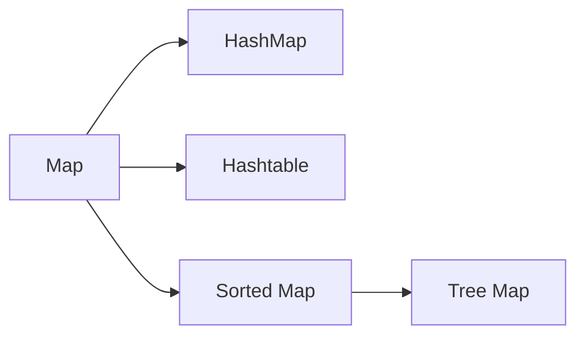

# Map

`Key` 와 `Value` 의 형태로 데이터를 관리한다.

## HashMap

HashMap 은 Map 인터페이스 계열의 대표적인 클래스이며 `get`, `put` 등의 메서드를 사용하여 데이터를 관리한다.

HashMap 계열은 각각의 특징에 따라 아래와 같인 차이점으로 나뉜다.

* HashMap
  * 동기화 보장이 안된다. (Thread-not-safe)
  * Key & Value 에 Null 허용
* Hashtable
  * 동기화 보장이 된다. (Thread-safe : 멀티스레드 환경에서 안정적)
  * Key & Value 에 Null 허용 불가
* TreeMap
  * 정렬 기능을 지원함

## Hashtable & ConcurrentHashMap

`HashMap` 을 thread-safe 하도록 만든 클래스가 ConcurrentHashMap 이며, key & value 에 null 을 허용하지 않는다.  
둘 다 동기화 보장을 하는 특징이 있지만 구조적으로 작은 차이가 있다.

* Hashtable
  * `synchronized` 키워드를 Method 전체에 Lock 을 적용한다.  
  * 상대적으로 안정하지만 확장성이 떨어진다.
  * Hashtable 을 참조하는 Thread 의 갯수가 많아질수록 Lock 을 획득하기 위한 시간비용이 많이 들어 성능이 급격히 낮아진다.
* ConcurrentHashMap
  * 내부적으로 여러개의 세그먼트를 두고 각 세그먼트마다 별도의 락을 가지고 있다.
  * 동시에 데이터를 삽입, 참조 하더라도 그 데이터가 다른 세그먼트에 위치하면 서로 Lock 을 얻기 위해 경쟁하지 않는다.
  * 이러한 방식을 _**Lock Striping**_ 이라고 한다.
  * Key & Value 에 Null 허용 불가

> ### 참고자료
> <http://egloos.zum.com/Agbird/v/4849046>

## HashMap 의 동작 과정

Java 에서의 HashMap 은 Key & Value 를 쌍으로 저장한다.  
이는 Hash 함수를 필요로 hashCode 를 통하여 값을 저장하고 불러내는 과정을 거친다.

HashMap 과 HashTable 은 Map 인터페이스를 구현하고 있기 때문에 HashMap 과 HashTable 의 제공하고 있는 기능은 거의 같다.  
다만 HashMap 은 _**보조해시함수 (Additional Hash Function)**_ 를 사용하고 있기 때문에 보조 해시함수를 사용하고 있지 않는 HashTable 에 비하여 해시 충돌 (Hash Colision) 이 덜 발생하고 있어 상대적으로 성능상의 이점을 보인다.

### 보조 해시 함수

저장하려는 두 개가 같은 인덱스로 해싱 (hashing : hash 함수를 통해 계산됨을 의미) 하게 되면 같은곳에 저장할 수 없게 된다.  
때문에 해싱된 인덱스에 이미 다른 값들이 들어있다면 데이터를 저장할 다른 위치를 찾은뒤에야 저장할 수 있다.

해시 충돌을 회피하는 방법들은 다음과 같다.

* 개방 주소법 (Open Address)
  * 해시충돌이 발생하면 다른 버킷 (데이터 주소 공간) 을 찾아 자료를 삽입하는 방식
  * 비어있는 버킷을 탐색하거나 혹은 2차 해시함수를 이용하여 새로운 주소를 할당한다.
* 분리 연결법 (Seperate Chaining)
  * Java HashMap 에서 사용중인 대표적인 방식
  * ??????????

이 외에도 _**해시 버킷의 동적 확장**_ 등과 같은 방법도 있다.

> ### 참고자료
> <https://asfirstalways.tistory.com/332>  
> <https://d2.naver.com/helloworld/831311>