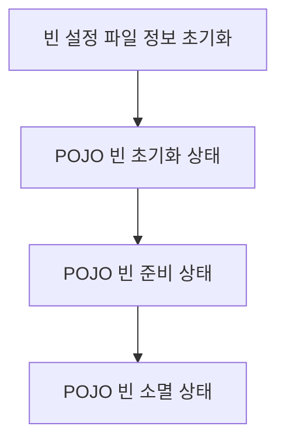

# Bean

스프링 (정확히는 스프링 컨테이너) 에서 생성 및 및 관계 설정, 사용등을 제어해주는 객체

## Bean Factory

* 스프링이 IoC 를 담당하는 핵심 컨테이너
* 빈을 등록/생성/조회/반환/관리 하는 기능으로 bean factory 와 같지만 여기에 spring 의 각종 부가서비스를 추가로 제공해야 한다.

## Application Context

* bean factory 를 확장한 IoC 컨테이너

## Container (IoC Container)

* 객체를 관리하는 컨테이너로써 컨테이너에 객체를 담아두고 필요할 때에 컨테이너에서 객체를 가져와 사용할 수 있도록 한다.
* IoC 방식으로 Bean 을 관리한다는 의미에서 Bean Factory 나 Application Context 를 가르킨다.

## POJO (Plain Old Java Object)

Sun 의 Java Bean 이나 EJB 의 Bean 을 뜻하는 것이 아닌 순수하게 `getter`, `setter` 메서드로만 이루어진 Value Object 성의 Bean 을 의미한다.  
예를 들면 다음과 같은 코드이다.

```java
public class SimpleBean {
    private String name;
    private String age;

    public void setName(String name) {
        this.name = name;
    }

    public String getName() {
        return this.name;
    }

    public void setAge(String age) {
        this.age = age;
    }

    public String getAge() {
        return this.age;
    }
}
```

스프링에서 POJO 가 중요한 특징인 이유는 다음과 같은 특성을 가지기 때문이다.

* 클래스위 상속을 강제하지 않는다.
* 인터페이스의 구현을 강제하지 않는다.
* 어노테이션의 사용을 강제하지 않는다.

때문에 사용자는 라이브러리나 컨테이너의 별도 기술에 종속적이지 않는 상태로 가장 일반적인 코드로 작성할 수 있다는 것이다.

> ### 참고자료
> <http://m.blog.naver.com/weekamp/186678831>  
> <https://joonyon.tistory.com/18>

## Spring Bean Life Cycle



> ### 참고자료
> <http://javaslave.tistory.com/48>  
> <https://gmlwjd9405.github.io/2018/11/10/spring-beans.html>  
> <https://unabated.tistory.com/entry/Spring-Bean-초기화-및-생명주기>

### POJO (Plain Old Java Object) 초기화 과정

1. Spring Framework 는 먼저 `Bean` 설정파일의 POJO 빈을 Instance 화 하지 않은 상태로 `Bean` 설정 파일의 정보를 초기화 한다.
    1. 빈 설정 파일의 정보를 초기화 하면서 XML DTD 에 대하여 유효한지 체크한다.
2. Bean Instance 를 생성하면서 의존 관계에 있는 Bean 이 존재하는지 여부를 체크한다.
    1. 의존 관계가 없는 Bean 인 경우 초기화가 실패 한다.
3. 의존 관계가 있는 빈의 체크가 완료되면 `setter Method` 를 호출하거나 생성자의 인자로 실질적인 값을 추가하거나 다른 Bean 에 대한 Reference 로 전달한다.
4. Application Context 를 이용하여 초기화를 실행한다.
    1. 생성한 Bean 이 BeanNameAware Instance 이면 setBeanName() Method 를 호출한다.
    2. 생성한 Bean 이 BeanFactoryAware Instance 이면 setBeanFactory() Method 를 호출한다.
    3. 생성한 Bean 이 ApplicationContextAware Instance 이면 setApplicationContext() Method 를 호출한다.
    4. 생성한 Bean 이 InitalizingBean 인스턴스이면 afterProperties() Method 를 호출한다.
5. 생성한 Bean 의 설정파일에 init-method 가 설정되어 있다면 init-method 에 해당하는 Method 를 호출한다.

### 종료 Method 를 호출하는 과정

1. 생성한 Bean 이 DisposableBean Instance 이면 `distory` Method 를 호출한다.
2. 생성한 Bean 설정파일에 distory-method 가 설정되어 있으면 `destory` Method 에 해당하는 메소드를 호출한다.

> Bean Life Cycle 을 커스터마이징 하여 제어 할 수 있다.

### Bean 로드 순서를 결정짓는 방법

Bean 내부적으로도 생성 순서에 따라 에러가 나올수 있기 때문에 해당 상황에서는 빈 생성 순서를 정해주는 것이 낫다

* `@DependsOn`
  * 의존성 고리를 스프링에게 알려준다.
* `@PostConstruct`
  * 해당 컴포넌트가 완전히 생성된 후 한번에 실행해야 할 일을 코딩한 메소드에 붙이는 것이다.
* `@Order`
  * 주입 순서를 정해 줌

> ### 참고자료
> <https://jeong-pro.tistory.com/167>

### `@Bean` vs `@Component` 차이

* `@Bean`
  * 외부 라이브러리들의 사용을 Bean 으로 등록하고 싶은 경우
* `@Component`
  * 사용자가 직접 컨트롤이 가능한 Class 인 경우

사용자가 생성한 클래스에 `@Bean` 선언은 불가능하다 이는 각자 선언할 수 있는 타입이 정해져 있어 해당 용도를 벗어나면 컴파일 에러를 발생시킨다.

> ### 참고자료
> <https://effectivesquid.tistory.com/entry/Bean-과-Component의-차이>

### Bean Scope

_**eGov**_ 및 _**Spring Reference (4.2.5)**_ 에서 발췌한 Bean Scope 의 종류이다.

| Scope | Description | eGov | Spring Reference |
|--|--|--|--|
| Global Session | 하나의 Bean 정의에 대해서 하나의 global HTTP Session의 생명주기 안에 단 하나의 객체만 존재한다. <br>일반적으로 portlet context 안에서 유효하다. Web-aware Spring ApplicationContext 안에서만 유효하다.| O | O |
| Prototype |하나의 Bean 정의에 대해서 다수의 객체가 존재할 수 있다.| O | O |
| Request | 하나의 Bean 정의에 대해서 하나의 HTTP request의 생명주기 안에 단 하나의 객체만 존재한다 <br>즉, 각각의 HTTP request는 자신만의 객체를 가진다. Web-aware Spring ApplicationContext 안에서만 유효하다.| O | O ||
| session | 하나의 Bean 정의에 대해서 하나의 HTTP Session의 생명주기 안에 단 하나의 객체만 존재한다. <br>Web-aware Spring ApplicationContext 안에서만 유효하다.| O | O |
| singleton | 하나의 Bean 정의에 대해서 Spring IoC Container 내에 단 하나의 객체만 존재한다.| O | O |
| application | 서블릿 컨텍스트의 라이프사이클에 정의된다. <br>Spring Application Context 내에서만 유효하다.| X | O |

> ### 참고자료
> <https://www.slipp.net/wiki/pages/viewpage.action?pageId=25528177>